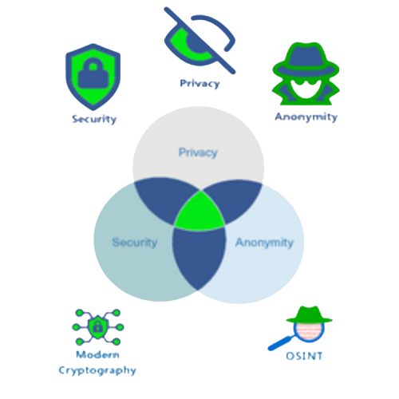

{ align=right }

## Notice  

**The current maintainers of this project are Than and Alex (they/them).**

Please share this project if you enjoy it and you think it might be useful to others.

## Contact the devs

??? person "@than"

    - [:simple-github: GitHub](https://github.com/nopeitsnothing "@nopeitsnothing")
    - [:simple-mastodon: Mastodon](https://ioc.exchange/@unknown "@unknown@ioc.exchange"){rel=me}
    - [:fontawesome-solid-house: Homepage](https://www.itsnothing.net)
    - [:fontawesome-solid-envelope: E-mail](mailto:nopenothinghere@proton.me)
    - [:simple-matrix: Matrix](https://matrix.to/#/@thehidden:tchncs.de)

??? person "@alex"

    - [:simple-github: GitHub](https://github.com/NobodySpecial256 "@NobodySpecial256")
    - [:fontawesome-solid-envelope: E-mail](mailto:theheadlessserpentsec@protonmail.com)
    - [:simple-matrix: Matrix](https://matrix.to/#/@memorysafetybelike:envs.net)

??? person "Anonymous Planet"  

    - [:simple-matrix: Our Matrix Space](https://matrix.to/#/#privacy-security-anonymity:matrix.org)
